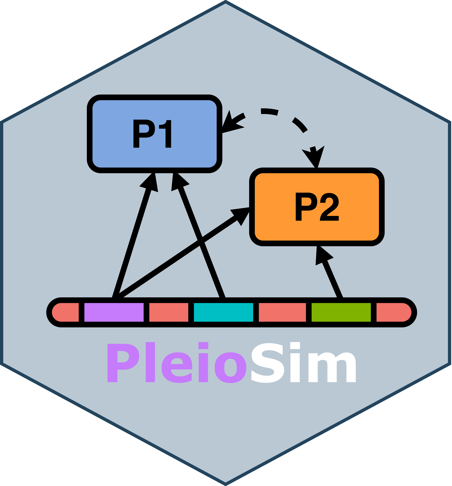

<!-- README.md is generated from README.Rmd. Please edit that file -->

# PleioSim <a href='https://github.com/Broccolito/pleiosim'></a>

<!-- badges: start -->

<br> <!-- badges: end -->

## Installation

``` r
# Install devtools if it is not yet installed
if(!require("devtools")){
  install.packages("devtools")
}

# Install senlinplot
if(!require("pleiosim")){
  devtools::install_github("Broccolito/pleiosim")
  library("pleiosim")
}
```

## Usage

Load the PleioSim package, set seed for the simulation

``` r
library(pleiosim)
set.seed(492357816)
```

Run Simulations:

``` r
pleio = pleiosim(
  n_sample = 10000,
  n_variant_pleiotropic = 10,
  n_variant_nonpleiotropic = c(10, 10, 10),
  n_variant_null = 960,
  eaf = rep(0.4, 1000),
  n_phenotype = 3,

  heritable_correlation_matrix = generate_uniform_heritable_correlation_matrix(0.4, 3),

  nonheritable_correlation_matrix = generate_uniform_nonheritable_correlation_matrix(0.2, 3),

  heritability = c(0.3, 0.4, 0.5),

  crosstrait_heterogeneity = TRUE,
  withintrait_heterogeneity = TRUE,
  random_crosstrait_heterogeneity = FALSE,
  random_withintrait_heterogeneity = TRUE
)

# Save simulation results as an R object
save(pleio, file = "pleio_simulation_object.rda")
```
